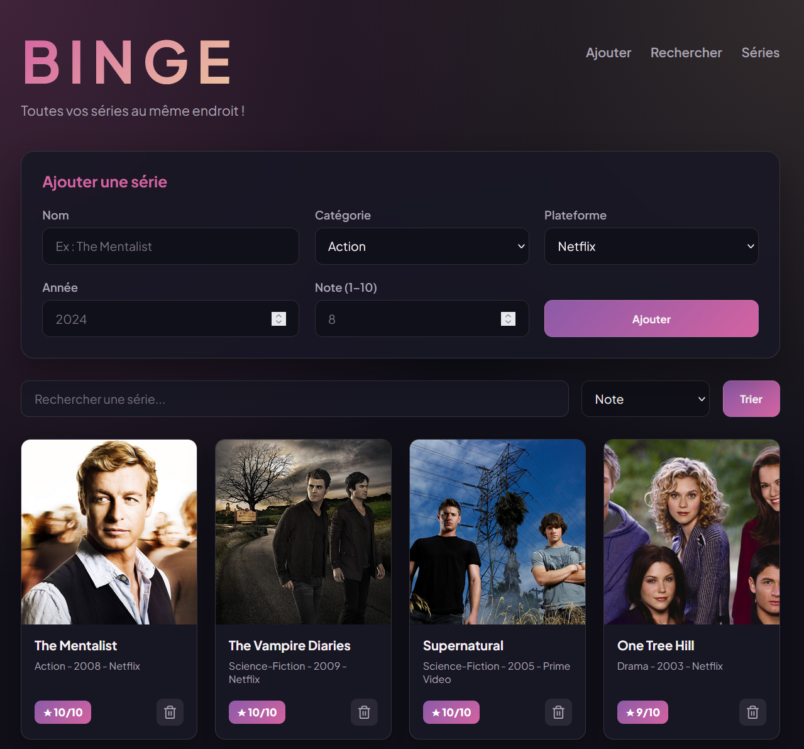
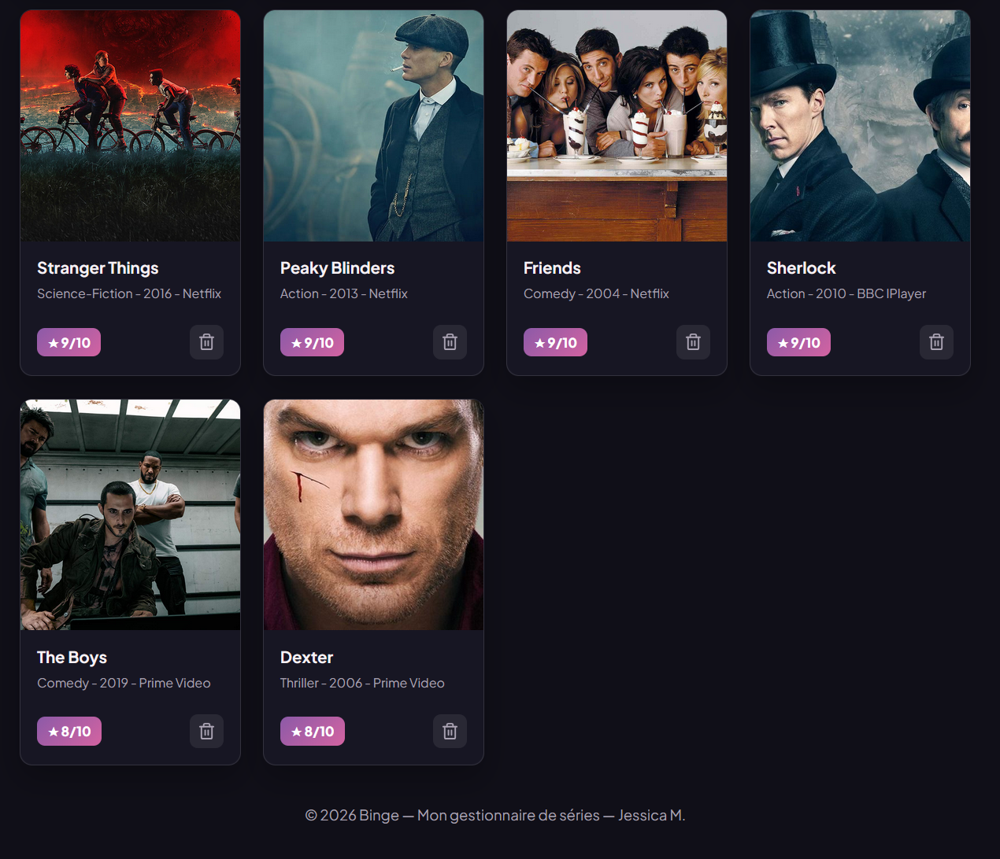

# Mon projet 122

Projet JavaScript — Cours 122 (ESIG)
Binge - Gestionnaire de séries télévisées
Jessica Morgado 

## Description

Binge est un site web permettant de gérer une bibliothèque personnelle de séries télévisées.
L'utilisateur peut consulter une liste de séries, les rechercher rapidement, les trier selon différents critères, 
ajouter de nouvelles séries et supprimer celles qu'il ne souhaite plus afficher.

J'ai choisi cette ressource car je suis passionnée de cinéma,tout particulièrement de séries et je trouvais intéressant 
de créer un site inspiré de plateformes comme TV Time ou Netflix. Ce projet m'a permis de travailler la manipulation du DOM, 
le codage en JavaScript ainsi que l'affichage dynamique de données.

## Lien GitHub Pages

https://sweetfallrain.github.io/122-projet-personnel-jessica-morgado/

## Fonctionnalités

- [x] Affichage dynamique de la liste
- [x] Tri par plusieurs critères
- [x] Recherche en temps réel
- [x] Ajout via formulaire
- [x] Suppression d'éléments
- [x] Responsive (mobile + desktop)

## Captures d'écran

## Transparence IA

### Outils utilisés
Claude & ChatGPT 

### Prompts utilisés
- Génère un tableau de données contenant 10 séries en indiquant un id, un nom, une catégorie, une plateforme, une note, une année de sortie et une image
- Améliore le visuel de mon site mais explique moi point par point ce que tu modifies !
- Aide moi à corriger mes erreurs de code et explique moi ce que je fais mal. 

### Ce que j'ai appris vs ce que l'IA a généré
L'IA m'a aidé à comprendre certaines notions JavaScript, à améliorer le design du projet et à générer certaines données d'exemple.

J'ai cependant réalisé moi-même l'intégration du projet, les modifications du code, la personnalisation du design, l'ajout des fonctionnalités et la compréhension de leur fonctionnement.

L'IA m'a notamment appris des éléments plus spécifiques comme l'utilisation de la fonction escapeHtml() qui permet de sécuriser les données affichées dans les cartes. 
Elle transforme certains caractères spéciaux afin d'éviter qu'un utilisateur puisse injecter du code HTML ou JavaScript dans la page.

